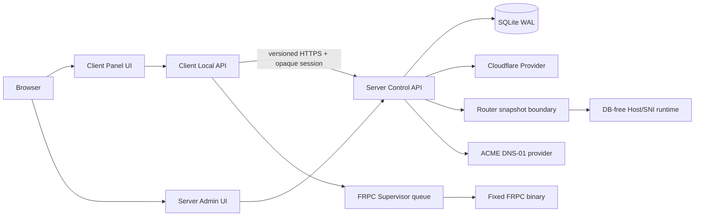

# Architecture boundary

The repository deliberately contains two Go modules and two Vue applications. The server is the authority for identity, resources, desired state and external operations. The client is a local runtime and never owns a user database, Cloudflare token, or permanent device identity.

There is no shared business package between `/server` and `/client`. `/contracts` only contains protocol descriptions and enums.

The Server worker writes signed `control_routes` and `business_routes` snapshots to the protected data directory. The Router runtime reads only that snapshot, verifies schema/hash/HMAC, and retains its last-good in-memory route table when a new snapshot is invalid. ACME account material is encrypted separately from certificate private keys; Cloudflare DNS TXT records are created and removed only for the active ACME operation.
